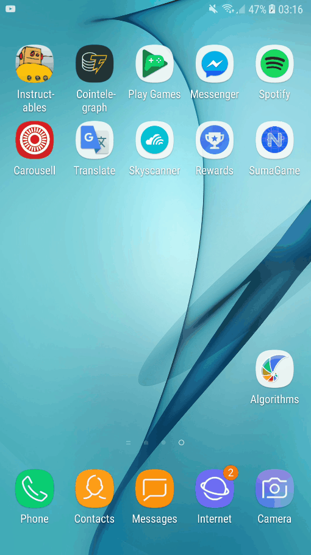

# SumaGame


## Game rules
* Given 6 numbers in the array, randomize and shown on the button.
* Guess the correct two numbers that sum up equals to the answer shown on the mobile app.
* Additional to the difficulty a timer ticks from 120 sec and if the timer reaches 0 is game over for the player!

```
chrome-devtools://devtools/bundled/inspector.html?experiments=true&ws=localhost:40000
```
